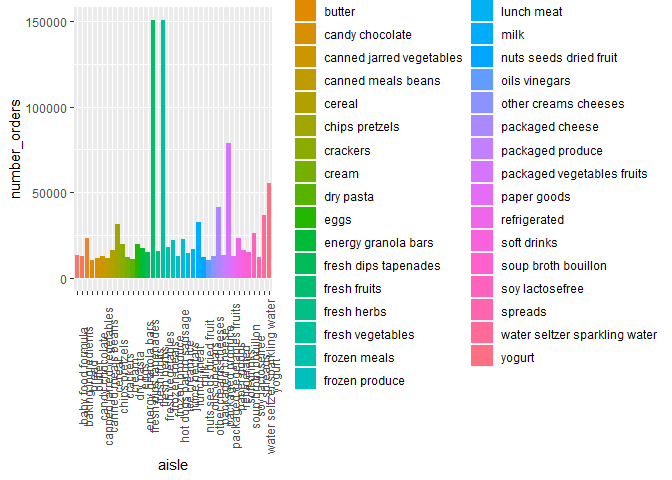

p8105\_hw3\_nk2814
================
Naama Kipperman
10/8/2019

### Problem 1

Load the Instacart data and necessary packages you might need.

``` r
library(p8105.datasets)
library(tidyverse)
```

    ## -- Attaching packages ------------------------------------ tidyverse 1.2.1 --

    ## v ggplot2 3.2.1     v purrr   0.3.2
    ## v tibble  2.1.3     v dplyr   0.8.3
    ## v tidyr   1.0.0     v stringr 1.4.0
    ## v readr   1.3.1     v forcats 0.4.0

    ## -- Conflicts --------------------------------------- tidyverse_conflicts() --
    ## x dplyr::filter() masks stats::filter()
    ## x dplyr::lag()    masks stats::lag()

``` r
library("sqldf")
```

    ## Loading required package: gsubfn

    ## Loading required package: proto

    ## Loading required package: RSQLite

``` r
library(dplyr)
data("instacart") 
```

The goal is to do some exploration of this dataset. To that end, write a
short description of the dataset, noting the size and structure of the
data, describing some key variables, and giving illstrative examples of
observations. Then, do or answer the following (commenting on the
results of each):

How many aisles are there, and which aisles are the most items ordered
from?

There are 134 distinct aisles. The aisles from which the most items are
ordered are ‘fresh vegetables’, ‘fresh fruits’, and ‘packaged vegetables
fruits’.

``` r
instacart %>% 
  janitor::clean_names() %>% 
  group_by(aisle) %>%
  summarize(
    number_orders=n()
  ) %>% 
  arrange(desc(number_orders))
```

    ## # A tibble: 134 x 2
    ##    aisle                         number_orders
    ##    <chr>                                 <int>
    ##  1 fresh vegetables                     150609
    ##  2 fresh fruits                         150473
    ##  3 packaged vegetables fruits            78493
    ##  4 yogurt                                55240
    ##  5 packaged cheese                       41699
    ##  6 water seltzer sparkling water         36617
    ##  7 milk                                  32644
    ##  8 chips pretzels                        31269
    ##  9 soy lactosefree                       26240
    ## 10 bread                                 23635
    ## # ... with 124 more rows

Make a plot that shows the number of items ordered in each aisle,
limiting this to aisles with more than 10000 items ordered. Arrange
aisles sensibly, and organize your plot so others can read it.

``` r
instacart %>% 
  janitor::clean_names() %>% 
  group_by(department, aisle) %>% 
  summarize(
    number_orders=n()
  ) %>% 
  arrange(desc(number_orders)) %>% 
  filter(number_orders > 10000) %>% 
  ggplot(aes(x=aisle, y=number_orders, color=department))+
  geom_col()+
  facet_grid(.~department)
```

<!-- -->
